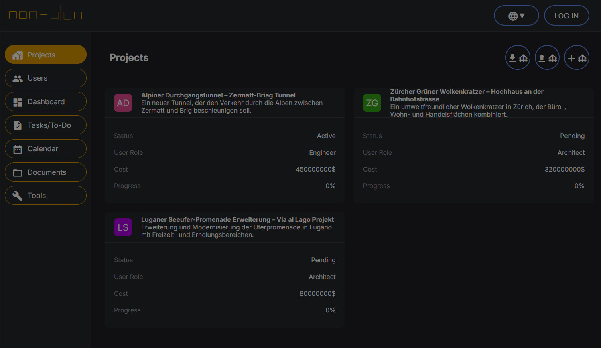

# Non-Plan Platform

A modern, feature-rich project management platform built with React, TypeScript, and Three.js. This platform provides comprehensive project management capabilities including Gantt charts, task dependencies, 3D model visualization, and multi-language support.



## 🚀 Features

### Core Project Management
- **Project Creation & Management**: Create, edit, and organize projects with detailed information
- **Task Management**: Comprehensive task system with status tracking, priorities, and assignments
- **User & Company Management**: Manage team members and company information
- **Custom Gantt Calendar**: Interactive timeline visualization with dependency mapping
- **Task Dependencies**: Visual dependency arrows showing task relationships

### Advanced Features
- **3D Model Visualization**: Integrated Three.js viewer for 3D models (.obj, .gltf formats)
- **Multi-language Support**: English, German, and Spanish localization
- **Real-time Updates**: Dynamic UI updates and data synchronization
- **Responsive Design**: Modern, mobile-friendly interface
- **Status Tracking**: Color-coded status indicators for projects and tasks

### Technical Features
- **TypeScript**: Full type safety and improved developer experience
- **React 18**: Modern React with hooks and functional components
- **Three.js Integration**: 3D rendering capabilities with orbit controls
- **CSS Custom Properties**: Themeable design system
- **Modular Architecture**: Clean, maintainable code structure

## 🛠️ Tech Stack

- **Frontend**: React 18, TypeScript
- **3D Graphics**: Three.js with examples modules
- **Styling**: CSS with custom properties
- **Build Tool**: Vite
- **Package Manager**: npm
- **Development**: TypeScript with strict mode

## 📦 Installation

### Prerequisites
- Node.js (v16 or higher)
- npm (v7 or higher)

### Setup
1. Clone the repository:
```bash
git clone <repository-url>
cd non-plan-platform
```

2. Install dependencies:
```bash
npm install
```

3. Start the development server:
```bash
npm run dev
```

4. Open your browser and navigate to `http://localhost:5173`

## 🏗️ Project Structure

```
non-plan-platform/
├── src/
│   ├── classes/                 # Core business logic classes
│   │   ├── Company.ts          # Company management
│   │   ├── CompaniesManager.ts # Companies collection management
│   │   ├── Project.ts          # Project entity and logic
│   │   ├── ProjectsManager.ts  # Projects collection management
│   │   ├── toDo.ts            # Task entity and UI logic
│   │   ├── toDoManager.ts     # Tasks collection management
│   │   ├── User.ts            # User entity and logic
│   │   └── UsersManager.ts    # Users collection management
│   ├── react-components/       # React UI components
│   │   ├── Banner.tsx         # Application header
│   │   ├── Calendar.tsx       # Custom Gantt calendar component
│   │   ├── Dashboard.tsx      # Main dashboard
│   │   ├── ProjectCard.tsx    # Project display card
│   │   ├── ProjectDetailsPage.tsx # Detailed project view
│   │   ├── ProjectsPage.tsx   # Projects listing page
│   │   ├── Sidebar.tsx        # Navigation sidebar
│   │   ├── ThreeViewer.tsx    # 3D model viewer component
│   │   ├── ToDoCard.tsx       # Task display card
│   │   ├── toDoPage.tsx       # Tasks management page
│   │   ├── UserCard.tsx       # User display card
│   │   ├── UsersPage.tsx      # Users management page
│   │   └── LanguageContext.tsx # Internationalization context
│   ├── text/
│   │   └── Language.ts        # Translation definitions
│   ├── utils/
│   │   └── modalUtils.ts      # Modal utility functions
│   ├── three-examples.d.ts    # Three.js type declarations
│   └── index.tsx              # Application entry point
├── assets/                     # Static assets
│   ├── company-logo.svg
│   ├── non-plan-logo.svg
│   ├── IntroPage/             # Landing page assets
│   ├── fossil/                # 3D model example files
│   └── Gear/                  # 3D model example files
├── style.css                  # Global styles and design system
├── index.html                 # HTML entry point
├── package.json               # Project dependencies and scripts
├── tsconfig.json              # TypeScript configuration
├── tsconfig.node.json         # Node-specific TypeScript config
└── vite.config.ts             # Vite build configuration
```

## 🎯 Usage

### Creating a Project
1. Navigate to the Projects page
2. Click "Add Project" button
3. Fill in project details (name, description, location, dates, etc.)
4. Assign users and set project status
5. Save the project

### Managing Tasks
1. Open a project from the Projects page
2. Navigate to the Tasks section
3. Click "Add Task" to create new tasks
4. Set task properties:
   - Title and description
   - Status (Pending, In Progress, Completed, On Hold)
   - Priority (Low, Medium, High, Critical)
   - Due dates and assignments
   - Dependencies on other tasks

### Using the Gantt Calendar
1. Go to the Tasks page
2. Select a project from the dropdown
3. View tasks on the timeline
4. See dependency arrows between related tasks
5. Hover over tasks for detailed information

### 3D Model Viewing
1. Open a project details page
2. The 3D viewer loads automatically on the right side
3. Use mouse controls to:
   - Left-click + drag: Rotate the view
   - Right-click + drag: Pan the view
   - Scroll: Zoom in/out

### User Management
1. Navigate to the Users page
2. Add new users with role assignments
3. Manage companies and their associations
4. Edit user permissions and details

## 🎨 Design System

The platform uses a comprehensive CSS custom properties system for consistent theming:

### Color Palette
- **Primary**: `#1CFFCA` (Bright cyan)
- **Complementary**: `#300B5F` (Deep purple)
- **Background**: `#300B5F` (Deep purple)
- **Accent Colors**: Various shades for status indicators

### Typography
- **Font Family**: Inter (Google Fonts)
- **Size Scale**: From 10px to 100px with semantic naming
- **Headings**: h0 through h7 with appropriate sizing

### Components
- **Cards**: Rounded corners with hover effects
- **Buttons**: Multiple variants (primary, secondary, tertiary)
- **Forms**: Consistent styling with focus states
- **Modals**: Backdrop blur with proper z-indexing

## 🔧 Development

### Available Scripts
- `npm run dev` - Start development server
- `npm run build` - Build for production
- `npm run preview` - Preview production build

### Code Quality
- **TypeScript**: Strict type checking enabled
- **ESLint**: Code linting and formatting
- **Modular Architecture**: Clean separation of concerns
- **Type Safety**: Comprehensive type definitions

### Adding New Features
1. **Business Logic**: Add classes in `src/classes/`
2. **UI Components**: Create React components in `src/react-components/`
3. **Styling**: Use CSS custom properties in `style.css`
4. **Types**: Define TypeScript interfaces alongside implementation

## 🌐 Internationalization

The platform supports multiple languages through the `LanguageContext`:

### Supported Languages
- **English** (en)
- **German** (de)
- **Spanish** (es)

### Adding Translations
1. Edit `src/text/Language.ts`
2. Add new translation keys to all language objects
3. Use the `useLanguage()` hook in components
4. Access translations with the `t()` function

## 🎮 3D Integration

### Supported Formats
- **OBJ**: Wavefront OBJ files with MTL materials
- **GLTF**: GL Transmission Format files

### Three.js Features
- **Orbit Controls**: Mouse/touch navigation
- **Material Loading**: MTL and texture support
- **Lighting**: Directional and ambient lighting
- **Responsive Rendering**: Automatic resize handling

## 📱 Browser Support

- **Chrome**: Latest 2 versions
- **Firefox**: Latest 2 versions
- **Safari**: Latest 2 versions
- **Edge**: Latest 2 versions

## 🤝 Contributing

1. Fork the repository
2. Create a feature branch: `git checkout -b feature/amazing-feature`
3. Commit your changes: `git commit -m 'Add amazing feature'`
4. Push to the branch: `git push origin feature/amazing-feature`
5. Open a Pull Request

### Development Guidelines
- Follow TypeScript best practices
- Maintain consistent code formatting
- Add type definitions for new features
- Update documentation for new functionality
- Test across different browsers

##  Acknowledgments

- **Three.js** - 3D graphics library
- **React** - UI framework
- **Vite** - Build tool
- **Inter Font** - Typography
- **Material Icons** - Icon system

## 📞 Support

For support, questions, or feature requests, please open an issue in the repository.

---

Built with ❤️ using React, TypeScript, and Three.js
